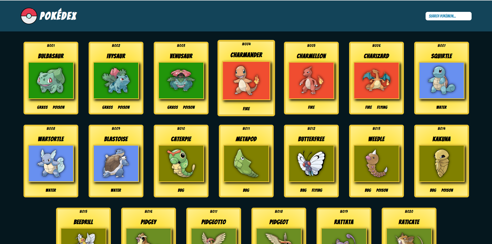

# 📘 Pokedex

Build your own digital Pokédex using JavaScript, HTML5 and REST APIs.



---

## 🧾 Description

A dynamic Pokédex that fetches and displays detailed Pokémon data such as names, stats, abilities, and types – using an external API.

Users can:
- Search for Pokémon
- Filter by name or number
- View detailed info with responsive design

---

## 🛠️ Implementation Details

- **API Integration** using `https://pokeapi.co/`
- **JavaScript (OOP)** for dynamic rendering and logic
- **Responsive Design** with HTML & CSS
- Dynamic DOM manipulation

---

## 🚀 Run Locally

Clone the repo and open `index.html` directly in your browser:

```bash
git clone https://github.com/YourUsername/pokedex.git
cd pokedex
open index.html
